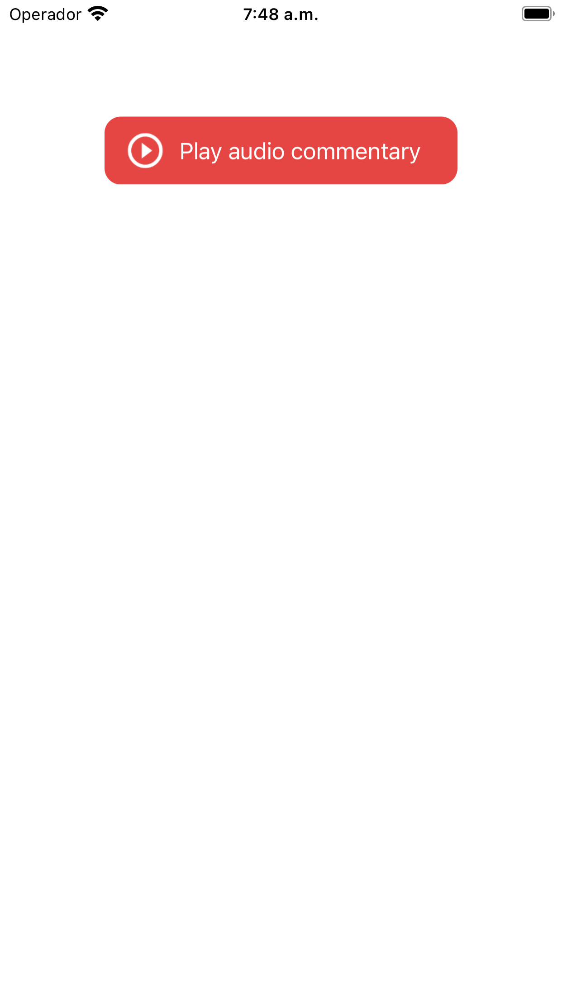

# GbVideoPlayer

component for live audio commentaries


 


[](https://cocoapods.org/pods/GbVideoPlayer)
[](https://cocoapods.org/pods/GbVideoPlayer)

## Installation

```ruby
pod 'GbVideoPlayer'
```


1. Add `GbVideoPlayer` to your `podfile` and run pod install
2. Add a `GbVideoPlayerView` to your `UIViewController` either programmatically or using storyboards.


## License

GbVideoPlayer is available under the MIT license. See the LICENSE file for more info.
